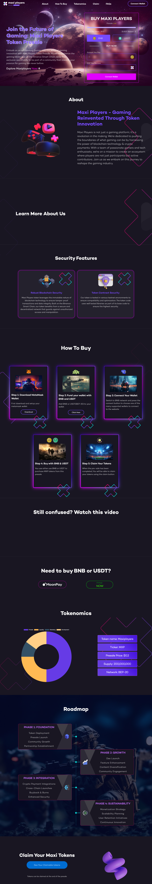

# Maxi Players Token Presale

A responsive cryptocurrency token presale landing page developed for a blockchain gaming project. The application showcases the Maxi Players ecosystem, allowing users to connect their wallets and participate in the token presale through a modern, responsive interface.

# Project Preview



---

# Overview

Maxi Players Token Presale is a modern Web3 landing page built to promote a blockchain gaming ecosystem and facilitate token presales on the Binance Smart Chain. The website provides project information, tokenomics, roadmap, FAQs, and wallet connectivity while maintaining a responsive and engaging user experience across desktop and mobile devices.

---

# Features

- Responsive landing page design
- Modern gaming-inspired user interface
- Wallet connection interface
- Token purchase using BNB and USDT
- Interactive Tokenomics section
- Roadmap timeline
- Step-by-step purchase guide
- Frequently Asked Questions (FAQ)
- Social media integration
- Mobile-friendly layout
- Smooth scrolling and animations

---

# Technologies Used

- HTML5
- CSS3
- JavaScript (ES6)
- Vite
- Ethers.js
- Binance Smart Chain (BSC)

---

# Skills Demonstrated

- Frontend Development
- Responsive Web Design
- Landing Page Development
- Web3 UI Integration
- Modern CSS Layouts
- JavaScript DOM Manipulation
- Performance Optimization
- Cross-browser Compatibility

---

# Repository Structure

```
.
├── images/
├── screenshots/
│   └── fullpage.png
├── index.html
├── style.css
├── main.js
├── package.json
└── README.md
```

---

# Project Purpose

This repository is shared as part of my professional portfolio to demonstrate frontend development skills, responsive UI implementation, and modern landing page design. Sensitive production credentials and deployment-specific configurations have been excluded.

---

# Author

**Moeen Akhtar**

**Portfolio:** https://www.moeenakhtar.vercel.app

**GitHub:** https://github.com/moeenA300

**LinkedIn:** https://linkedin.com/in/moeenakhtar300
